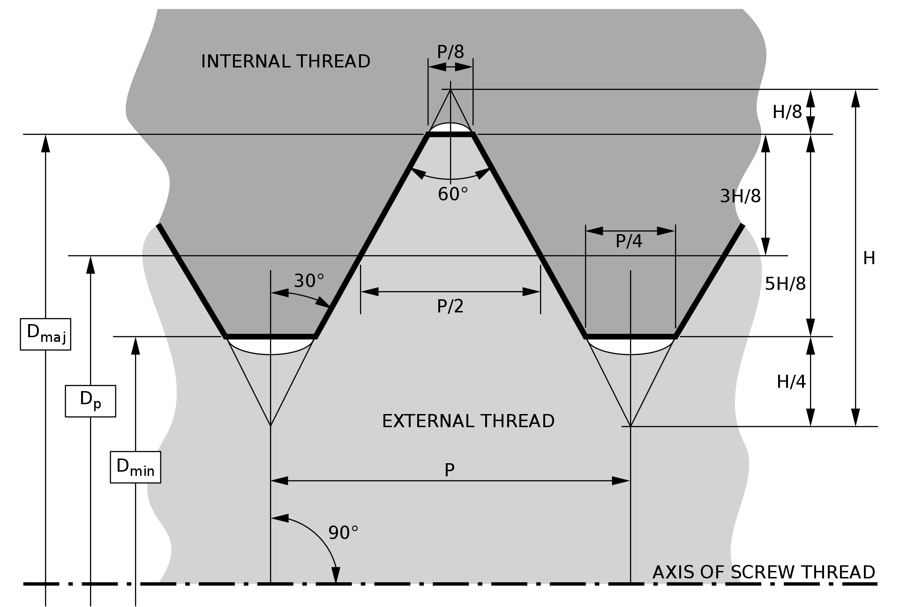

# Thread Experiments

Experiments with cadquery threads.

Original code authored by Adam, see [this post](https://groups.google.com/g/cadquery/c/5kVRpECcxAU/m/7no7_ja6AAAJ)

Currently can create an 8m nut and bolt, the fit is "sloppy" but
will be improved. Something else that needs imporvement is the variable
names should match common nomenclature. Here are some sources:

- https://en.wikipedia.org/wiki/ISO_metric_screw_thread

- https://en.wikipedia.org/wiki/Unified_Thread_Standard
- http://www.afi.cc/?page=customer&file=customer/asfain/customerpages/Blog/ScrewThreadTerminology.htm
- http://portal.ku.edu.tr/~cbasdogan/Courses/MDesign/course_notes/fasteners.pdf

Run `make` with no parameters to see help.
